# GBR KARDEK – Inventariador · Mapa de Navegação (GRAPH TD canônico)

> **Fonte de verdade da estrutura de telas e transições.** Mantenha este documento em
> sincronia com `src/types.ts` (enum `AppScreen`), `src/router/routes.tsx` (`screenToPath`)
> e o switch de render no `src/App.tsx`.
> O teste de contrato `src/__tests__/navigationMap.test.ts` valida este mapa
> (rota única por tela, zero telas órfãs, cobertura dos nós do grafo).

## 1. Grafo de navegação (Mermaid)

```mermaid
graph TD
    %% Telas de Autenticação e Acesso Inicial
    LOGIN[Login]
    REGISTER[Cadastro de Usuário]
    BIOMETRIC[Registro Biométrico]
    CHANGE_PWD[Alteração de Senha]
    STRESS[Stress Test / Carga]

    %% Módulos e Seleção de Unidade
    MODULE_SEL[Seleção de Módulo]
    ASSET_CONTROL[Controle de Ativos e Movimentações]
    UNIT_SEL[Seleção de Unidade Operacional]
    DB_MGR[Gerenciador de Banco de Dados]

    %% Hub Principal
    DASHBOARD[Dashboard da Unidade]
    MAIN_MENU[Menu Principal e Configurações]

    %% Operações de Inventário e Campo
    ADDR_SEL[Seleção de Endereço / Local]
    INVENTORY[Tela de Inventário e Bipagem]
    LABELING[Etiquetagem / Plaqueta]
    ACTIVE_SEARCH[Busca Ativa de Ativos]
    CONSULTATION[Consulta Geral de Ativos]
    ASSET_MAP[Mapa Georeferenciado de Ativos]

    %% Detalhes e Documentação
    ASSET_DETAIL[Ficha Detalhada do Ativo]
    SIGNATURE[Assinatura do Laudo de Inventário]
    ASSET_PRINT[Visualização de Impressão de Ficha]

    %% Gestão, Relatórios e Configurações
    CAMPAIGNS[Gestão de Campanhas]
    UNIT_CFG[Configurador de Unidades e GPS]
    USER_MGT[Gestão de Usuários]
    FIELD_CFG[Campos Editáveis]
    QR_CFG[Configuração de QR Code]
    AUDIT_LOGS[Logs de Auditoria]
    GLOBAL_PERF[Performance Global]
    RECONCILIATION[Reconciliação Contábil]
    SOFT_DELETE[Relatório de Ativos Excluídos]
    IMPAIRMENT[Relatório de Impairment]
    SYNC_MGR[Gerenciador de Sincronização]
    ONBOARDING[Tutorial / Onboarding]

    %% Transições - Autenticação
    LOGIN -->|Validação de Credenciais| MODULE_SEL
    LOGIN -->|Clique em Novo Usuário| REGISTER
    LOGIN -->|Detectada Opção Biométrica| BIOMETRIC
    LOGIN -->|Troca Obrigatória de Senha| CHANGE_PWD
    LOGIN -->|Clique em Stress Test| STRESS
    REGISTER -->|Cadastro Concluído / Voltar| LOGIN
    BIOMETRIC -->|Concluir ou Ignorar| MODULE_SEL
    CHANGE_PWD -->|Senha Atualizada| UNIT_SEL
    STRESS -->|Voltar| LOGIN

    %% Transições - Módulos e Seleção
    MODULE_SEL -->|Selecionar Módulo Inventário| UNIT_SEL
    MODULE_SEL -->|Selecionar Módulo Controle| ASSET_CONTROL
    MODULE_SEL -->|Gerenciar Banco Local ou Nuvem| DB_MGR
    MODULE_SEL -->|Clique em Sair / Logout| LOGIN
    ASSET_CONTROL -->|Voltar ao Menu de Módulos| MODULE_SEL
    UNIT_SEL -->|Selecionar Unidade| DASHBOARD
    UNIT_SEL -->|Carga / Migração de Dados| DB_MGR
    UNIT_SEL -->|Trocar Módulo| MODULE_SEL
    DB_MGR -->|Voltar| MODULE_SEL

    %% Transições - Dashboard
    DASHBOARD -->|Iniciar Bipagem / Selecionar Local| ADDR_SEL
    DASHBOARD -->|Abrir Etiquetagem| LABELING
    DASHBOARD -->|Abrir Busca Ativa| ACTIVE_SEARCH
    DASHBOARD -->|Consultar Ativos| CONSULTATION
    DASHBOARD -->|Visualizar Mapa| ASSET_MAP
    DASHBOARD -->|Menu Principal e Opções| MAIN_MENU
    DASHBOARD -->|Trocar Unidade| UNIT_SEL

    %% Transições - Inventário e Campo
    ADDR_SEL -->|Confirmar Local| INVENTORY
    ADDR_SEL -->|Voltar| DASHBOARD
    INVENTORY -->|Clique no Ativo / Ver Ficha| ASSET_DETAIL
    INVENTORY -->|Finalizar Lote e Assinar| SIGNATURE
    INVENTORY -->|Voltar| ADDR_SEL
    SIGNATURE -->|Confirmar Assinatura| INVENTORY
    SIGNATURE -->|Cancelar| INVENTORY

    LABELING -->|Selecionar Ativo| ASSET_DETAIL
    LABELING -->|Voltar| DASHBOARD

    ACTIVE_SEARCH -->|Selecionar Ativo| ASSET_DETAIL
    ACTIVE_SEARCH -->|Voltar| DASHBOARD

    CONSULTATION -->|Ver Ficha| ASSET_DETAIL
    CONSULTATION -->|Retornar com Tag Bipada| INVENTORY
    CONSULTATION -->|Voltar| DASHBOARD

    ASSET_MAP -->|Selecionar Ponto no Mapa| INVENTORY
    ASSET_MAP -->|Voltar| DASHBOARD

    ASSET_DETAIL -->|Imprimir Ficha do Ativo| ASSET_PRINT
    ASSET_DETAIL -->|Voltar| INVENTORY
    ASSET_PRINT -->|Voltar| ASSET_DETAIL

    %% Transições - Menu Principal e Gestão
    MAIN_MENU -->|Gestão de Campanhas| CAMPAIGNS
    MAIN_MENU -->|Configurar Unidades e GPS| UNIT_CFG
    MAIN_MENU -->|Gerenciar Usuários| USER_MGT
    MAIN_MENU -->|Configurar Campos Editáveis| FIELD_CFG
    MAIN_MENU -->|Configurar QR Code| QR_CFG
    MAIN_MENU -->|Logs de Auditoria| AUDIT_LOGS
    MAIN_MENU -->|Performance Global| GLOBAL_PERF
    MAIN_MENU -->|Reconciliação Contábil| RECONCILIATION
    MAIN_MENU -->|Ativos Excluídos| SOFT_DELETE
    MAIN_MENU -->|Relatório Impairment| IMPAIRMENT
    MAIN_MENU -->|Gerenciador de Sync| SYNC_MGR
    MAIN_MENU -->|Tutorial e Onboarding| ONBOARDING
    MAIN_MENU -->|Trocar Unidade| UNIT_SEL
    MAIN_MENU -->|Voltar ao Dashboard| DASHBOARD

    CAMPAIGNS -->|Ativar Campanha| INVENTORY
    CAMPAIGNS -->|Voltar| MAIN_MENU
    UNIT_CFG -->|Voltar| MAIN_MENU
    USER_MGT -->|Voltar| MAIN_MENU
    FIELD_CFG -->|Voltar| MAIN_MENU
    QR_CFG -->|Voltar| MAIN_MENU
    AUDIT_LOGS -->|Voltar| MAIN_MENU
    GLOBAL_PERF -->|Voltar| MAIN_MENU
    RECONCILIATION -->|Voltar| MAIN_MENU
    SOFT_DELETE -->|Voltar| MAIN_MENU
    IMPAIRMENT -->|Voltar| MAIN_MENU
    SYNC_MGR -->|Voltar| MAIN_MENU
    ONBOARDING -->|Concluir Onboarding| DASHBOARD
```

## 2. Status de implementação (auditoria de 05/08/2026)

**32/32 nós do grafo → implementados** (enum + componente + render no `App.tsx` + rota única).

| Nó do grafo | AppScreen | Rota | Render |
|---|---|---|---|
| LOGIN | `LOGIN` | `/login` | ✅ (Route `/login`) |
| REGISTER | `REGISTER` | `/register` | ✅ |
| BIOMETRIC | `BIOMETRIC_REGISTRATION` | `/biometric` | ✅ |
| CHANGE_PWD | `CHANGE_PASSWORD` | `/change-password` | ✅ |
| STRESS | `STRESS_TEST` | `/stress-test` | ✅ |
| MODULE_SEL | `MODULE_SELECTION` | `/modules` | ✅ |
| ASSET_CONTROL | `ASSET_CONTROL_HOME` | `/asset-control` | ✅ |
| UNIT_SEL | `UNIT_SELECTION` | `/unit` | ✅ |
| DB_MGR | `DATABASE_MANAGER` | `/db-manager` | ✅ (Route `/db-manager`) |
| DASHBOARD | `DASHBOARD` | `/dashboard` | ✅ (Route `/dashboard`) |
| MAIN_MENU | `MAIN_MENU` | `/menu` | ✅ (Route `/menu`) |
| ADDR_SEL | `ADDRESS_SELECTION` | `/address` | ✅ |
| INVENTORY | `INVENTORY` | `/inventory` | ✅ |
| LABELING | `LABELING` | `/labeling` | ✅ |
| ACTIVE_SEARCH | `ACTIVE_SEARCH` | `/search` | ✅ |
| CONSULTATION | `CONSULTATION` | `/consultation` | ✅ |
| ASSET_MAP | `ASSET_MAP` | `/map` | ✅ |
| ASSET_DETAIL | `ASSET_DETAIL` | `/asset/` | ✅ |
| SIGNATURE | `SIGNATURE` | `/signature` | ✅ |
| ASSET_PRINT | `ASSET_REPORT_PRINT` | `/print` | ✅ |
| CAMPAIGNS | `CAMPAIGN_MANAGEMENT` | `/campaigns` | ✅ |
| UNIT_CFG | `UNIT_CONFIGURATOR` | `/unit-config` | ✅ |
| USER_MGT | `USER_MANAGEMENT` | `/users` | ✅ |
| FIELD_CFG | `FIELD_CONFIGURATOR` | `/fields` | ✅ |
| QR_CFG | `QR_CODE_CONFIGURATOR` | `/qr-config` | ✅ |
| AUDIT_LOGS | `AUDIT_LOGS` | `/audit-logs` | ✅ |
| GLOBAL_PERF | `GLOBAL_PERFORMANCE` | `/performance` | ✅ |
| RECONCILIATION | `ACCOUNT_RECONCILIATION` | `/reconciliation` | ✅ |
| SOFT_DELETE | `SOFT_DELETE_REPORT` | `/soft-delete` | ✅ |
| IMPAIRMENT | `IMPAIRMENT_REPORT` | `/impairment` | ✅ |
| SYNC_MGR | `SYNC_MANAGER` | `/sync` | ✅ |
| ONBOARDING | `ONBOARDING` | `/onboarding` | ✅ |

## 3. Decisões de transição (fonte de verdade — caso a caso)

O grafo acima é o **alvo de negócio**. Onde o comportamento implementado difere do
literal do grafo, a decisão registrada é a seguinte:

| # | Transição | Grafo (literal) | Implementado | Decisão |
|---|---|---|---|---|
| 1 | ONBOARDING → | `DASHBOARD` | `MODULE_SELECTION` | **Manter `MODULE_SELECTION`.** `DASHBOARD` exige `selectedUnit` (Barreira Canônica — guarda em `App.tsx`); no pós-login/primeiro acesso o usuário ainda não escolheu unidade, e navegar para `DASHBOARD` causaria recuo forçado para `UNIT_SELECTION`. O grafo será atualizado para refletir o destino correto. |
| 2 | CHANGE_PWD → | `UNIT_SEL` | `UNIT_SELECTION`, **exceto** base vazia + admin → `MAIN_MENU` | **Manter o desvio.** Com base vazia, não há unidades para selecionar; o admin vai ao menu de dados (`startWithDataMenu`) para forçar a carga. Consistente com o roteamento "base vazia + admin → Gestor de Base" (ARCHITECTURE §6). |
| 3 | LOGIN → BIOMETRIC | acionado na tela de login | pós-login automático (`pushScreen(BIOMETRIC_REGISTRATION)` após auth, com `popScreen` ao concluir/ignorar) | **Manter.** Resultado equivalente ao grafo: usuário cai em `MODULE_SELECTION` após concluir/ignorar (o `pop` retorna à tela abaixo, que é o destino pós-login). |
| 4 | STRESS → | `LOGIN` | `setHistory([LOGIN])` ao voltar | ✅ Conforme o grafo. Sem mudança. |

## 4. Higienização estrutural (consolidado em 05/08/2026)

Removidas **2 telas órfãs** do enum/rotas (zero referências no código — nunca renderizadas):

| Removido | Antes | Motivo |
|---|---|---|
| `AppScreen.SETTINGS` | rota `/sync` (colidia com `SYNC_MANAGER`) | Alias legado sem render; consolidado em `SYNC_MANAGER` |
| `AppScreen.QR_CONFIGURATOR` | rota `/qr-config` (colidia com `QR_CODE_CONFIGURATOR`) | Alias legado sem render; consolidado em `QR_CODE_CONFIGURATOR` |

**Contrato agora vigente (validado por `src/__tests__/navigationMap.test.ts`):**
- todo `AppScreen` possui rota única em `screenToPath`;
- nenhuma rota duplicada;
- todo `AppScreen` é referenciado no `App.tsx` (zero telas órfãs);
- os 32 nós do grafo acima estão cobertos pelo enum.

## 5. Referências

- `src/types.ts` — enum `AppScreen` (fonte das telas)
- `src/router/routes.tsx` — `screenToPath` (rota por tela)
- `src/App.tsx` — render condicional por `screen` + `<Route>` explícitas
- `src/__tests__/navigationMap.test.ts` — teste de contrato deste mapa
- `docs/ARCHITECTURE.md` — arquitetura geral (navegação dual, guardas, fluxos)
